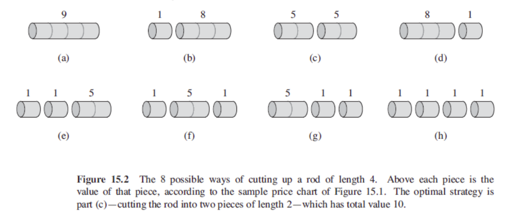
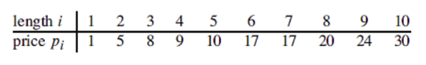
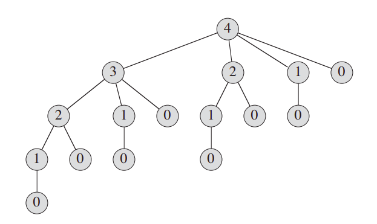
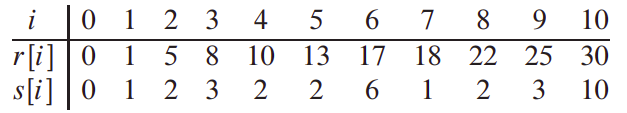

# CMP302: Design and Analysis of Algorithms Summary

This repository is a summary for the course, it will contain my own implementation (in C++) for included algorithms, along with pseudocode, important notes and complexity analysis for each algorithm.

# Table of Contents

- [Dynamic Programming](#dynamic-programming)
- [Greedy Algorithms]()
- [Graphs]()
  - [placeholder]()
- [NP Completeness]()
- [String Matching]()
- [Appendix]()

# Dynamic Programming

A faster technique to solve divide-and-conquer problems, usually decreases running time from **exponential** to **linear**.

## Conditions for DP solution satisfaction:
1. Optimal Substructure
    - An optimal solution to the problem can be constructed from the optimal solution of its subproblems.
2. Overlapping Subproblems
    - Subproblems solutions are re-used multiple times.

## Types of DP solutions:
A DP solution can be one of the following two types:
1. Top-down approach **(Memoization)**
   - Start from the big problem and work your way down, decomposing the big problem to multiple smaller ones. 
   - Involves recursion which usually takes more memory space than bottom-up solutions.
   - Usually easier to implement than bottom-up solutions.
2. Bottom-up approach **(Tabulation)**
   - Start from the smallest problem and work your way up to the bigger one.
   - Iterative solution (with loops).
   - Saves memory space (no recursion required).
   - Harder to implement

## Bottom-up solution steps
Any bottom-up solution contains 3 major pillars.
1. Base case
    - The recursion termination condition
2. State
    - The base parameters of the recursion method.
    - Must be able to uniquely identify all the states of the recursion.
    - The size of the state impacts the time and memory complexity of the solution.
3. Transition
    - The relation between a problem and its subproblems.
    - The way to construct the bigger problem using its smaller subproblems.

When solving any DP problem we must figure out these 3 things, usually finding out the base case is trivial, we must then think about the state or the transition (whichever is easier).

## Complexity of DP

- DP complexity = )
Example: 
State = 
Complexity = 

## Fibonacci

Fibonacci can be implemented recursively in a **naive** way as follows:
```py
def fib(n):
  if(n == 1 or n == 2)
    return 1
  else
    return fib(n-1) + fib(n-2)
```
However, this implementation is not very well as it is $O(2^n)$.

We can improve this by adding **memoization**:
```py
def fib(n):
  if(n == 1 or n == 2)
    return 1
  
  if(n in memo)
    return memo[n]

  memo[n] = fib[n-1] + fib[n-2]
  return memo[n]
```
This improves the complexity to $O(n)$, however this takes memory space $O(n)$.

This can also be implemented with **tabulation**:
```py
def fib(n):
  fib[0] = 0
  fib[1] = 1
  for i in 2:n
    fib[i] = fib[i-1] + fib[i-2]
  return fib[n]
```

## Rod Cutting

Cut rod of length n to maximize revenue based on a price table.



Can be solved naively by:
  1. Cut a piece at the left end of the rod, and sell it.
  2. Find an optimal way to cut the remainder of the rod.
```py
def cut_rod(n, p): # p is array of prices of piece i
  if (n == 0)
    return 0

  q = -inf
  for i in 1:n
    q = max(q, p[i] + cut_rod(p, n - i))

  return q
```

**Runtime:** $O(2^n)$, we can try to optimize this algorithm using dynamic programming, but first we need to check if a DP approach is applicable, by inspecting the recursion tree:



This tree has $O(2^n)$ leaves which corresponds to the solution complexity, however we can notice a lot of **overlapping subproblems**.

Implementing this with **memoization**:
```py
def cut_rod(n, p):
  if (n == 0)
    return 0

  if (n in memo)
    return memo[n]

  q = -inf
  for i in 1:n
    q = max(q, p[i] + cut_rod(n - i, p))

  memo[n] = q
  return q
```

**Runtime:** $\Theta(n^2)$

*Note the similarities between the memoization solution and the naive solution, they are very similar, the memoization solution is basically the naive solution but with an extra memoization part that checks if a subproblem has been calculated before.*

We can also start from smaller rods and build our answer up to the bigger rods, implementing this with **tabulation**:

```py
def cut_rod(n, p):
  r[0..n] = new array
  r[0] = 0

  for j in 1:n
    q = -inf
    for i in 1:j
      q = max(q, p[i] + r[j - i])
    r[j] = q

  return r[n]
```

**Runtime:** $\Theta(n^2)$

**Explanation:** $r[0..n]$ is an array containing the optimal answers for all cuts at any given iteration, for each rod length $n$ we can define its optimal answer as $max_{i=0}^{i=n}(p[i] + r[n - i])$. 
*We attempt cutting a piece of length $i$ and add it to the optimal answer of $n - i$ for all possible $i$.*


### Finding optimal cuts
We have previously calculated the maximum profit of the rod cutting problem, we have yet to find the optimal way of cutting. We can achieve that by creating a new array and for a given $n$ store the length of the piece cut at the left of the rod.



```py
def cut_rod_extended(n, p):
  r[0..n], s[0..n] = new array
  r[0] = 0

  for j in 1:n
    q = -inf

    for i in 1:j
      current_price = p[i] + r[j - i]
      if q < r
        s[n] = i
        q = current_price

    r[j] = q

  return r[n], s


def print_cut_rod(n, s):
  while n > 0
    print s[n]
    n = n - s[n]
```