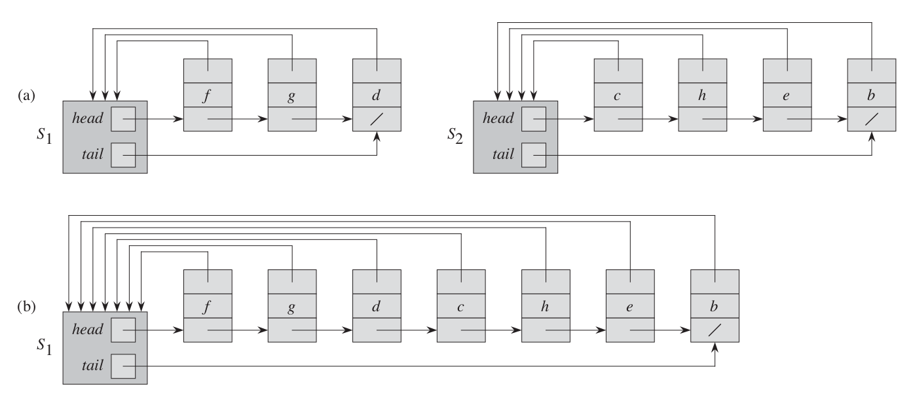

# CMP302: Design and Analysis of Algorithms Summary

This repository is a summary for the course, it will contain my own implementation (in C++) for included algorithms, along with pseudocode, important notes and complexity analysis for each algorithm.

# Table of Contents

- [CMP302: Design and Analysis of Algorithms Summary](#cmp302-design-and-analysis-of-algorithms-summary)
- [Table of Contents](#table-of-contents)
- [Dynamic Programming](#dynamic-programming)
  - [Conditions for DP solution satisfaction](#conditions-for-dp-solution-satisfaction)
  - [Types of DP solutions](#types-of-dp-solutions)
  - [Top-down solution steps](#top-down-solution-steps)
  - [Complexity of DP](#complexity-of-dp)
  - [Fibonacci](#fibonacci)
  - [Rod Cutting](#rod-cutting)
    - [Finding optimal cuts](#finding-optimal-cuts)
  - [Matrix Chain Multiplication](#matrix-chain-multiplication)
    - [Naive approach](#naive-approach)
    - [Recursive approach](#recursive-approach)
    - [Top-down approach](#top-down-approach)
    - [Bottom-up approach](#bottom-up-approach)
- [Greedy Algorithms](#greedy-algorithms)
  - [Solution Steps](#solution-steps)
  - [Activity Selection](#activity-selection)
  - [Knapsack Problem](#knapsack-problem)
    - [0-1 Knapsack](#0-1-knapsack)
    - [Fractional Knapsack](#fractional-knapsack)
  - [Huffman Codes](#huffman-codes)
- [Graphs](#graphs)
  - [Graph Representations](#graph-representations)
  - [Breadth First Search (BFS)](#breadth-first-search-bfs)
  - [Depth First Search (DFS)](#depth-first-search-dfs)
  - [Topological Sort](#topological-sort)
  - [Strongly Connected Components (SCC)](#strongly-connected-components-scc)
  - [Disjoint Sets Union (DSU)](#disjoint-sets-union-dsu)
    - [DSU Operations](#dsu-operations)
    - [DSU Representations](#dsu-representations)
      - [Linked List representation](#linked-list-representation)
      - [Tree representation](#tree-representation)
    - [DSU Applications](#dsu-applications)
      - [Graph Connected Components](#graph-connected-components)
  - [Minimum Spanning Tree (MST)](#minimum-spanning-tree-mst)
    - [Kruskal's algorithm](#kruskals-algorithm)
    - [Prim's algorithm](#prims-algorithm)
  - [Shortest Paths](#shortest-paths)
    - [Single Source Shortest Paths](#single-source-shortest-paths)
      - [Bellman Ford](#bellman-ford)
      - [Directed Acyclic Graph (DAG) shortest-path](#directed-acyclic-graph-dag-shortest-path)
      - [Djikstra](#djikstra)
    - [All-pairs shortest paths](#all-pairs-shortest-paths)
      - [Dynamic Programming shortest paths](#dynamic-programming-shortest-paths)
      - [Floyd-Warshall algorithm](#floyd-warshall-algorithm)
      - [Applications on all-pairs shortest paths](#applications-on-all-pairs-shortest-paths)
        - [Transitive closure](#transitive-closure)
        - [Johnson's algorithm](#johnsons-algorithm)

# Dynamic Programming

A faster technique to solve divide-and-conquer problems, usually decreases running time from **exponential** to **linear**.

## Conditions for DP solution satisfaction
1. Optimal Substructure
    - An optimal solution to the problem can be constructed from the optimal solution of its subproblems.
2. Overlapping Subproblems
    - Subproblems solutions are re-used multiple times.

## Types of DP solutions
A DP solution can be one of the following two types:
1. Top-down approach **(Memoization)**
   - Start from the big problem and work your way down, decomposing the big problem to multiple smaller ones. 
   - Involves recursion which usually takes more memory space than bottom-up solutions.
   - Usually easier to implement than bottom-up solutions.
2. Bottom-up approach **(Tabulation)**
   - Start from the smallest problem and work your way up to the bigger one.
   - Iterative solution (with loops).
   - Saves memory space (no recursion required).
   - Harder to implement

## Top-down solution steps
Any Top-down solution contains 3 major pillars.
1. Base case
    - The recursion termination condition
2. State
    - The base parameters of the recursion method.
    - Must be able to uniquely identify all the states of the recursion.
    - The size of the state impacts the time and memory complexity of the solution.
3. Transition
    - The relation between a problem and its subproblems.
    - The way to construct the bigger problem using its smaller subproblems.

When solving any DP problem we must figure out these 3 things, usually finding out the base case is trivial, we must then think about the state or the transition (whichever is easier).

## Complexity of DP

- DP complexity = $O(\text{product of state size} * \text{function work})$

Example: 
State = $[1000][5000]$
Complexity = $O(1000*5000*\text{function work})$

## Fibonacci

Fibonacci can be implemented recursively in a **naive** way as follows:
```py
def fib(n):
  if(n == 1 or n == 2)
    return 1
  else
    return fib(n-1) + fib(n-2)
```
However, this implementation is not very well as it is $O(2^n)$.

We can improve this by adding **memoization**:
```py
def fib(n):
  if(n == 1 or n == 2)
    return 1
  
  if(n in memo)
    return memo[n]

  memo[n] = fib[n-1] + fib[n-2]
  return memo[n]
```
This improves the complexity to $O(n)$, however this takes memory space $O(n)$.

This can also be implemented with **tabulation**:
```py
def fib(n):
  fib[0] = 0
  fib[1] = 1
  for i in 2:n
    fib[i] = fib[i-1] + fib[i-2]
  return fib[n]
```

## Rod Cutting

Cut rod of length n to maximize revenue based on a price table.


Can be solved naively by:
  1. Cut a piece at the left end of the rod, and sell it.
  2. Find an optimal way to cut the remainder of the rod.
```py
def cut_rod(n, p): # p is array of prices of piece i
  if (n == 0)
    return 0

  q = -inf
  for i in 1:n
    q = max(q, p[i] + cut_rod(p, n - i))

  return q
```

- **Runtime:** $O(2^n)$
  - we can try to optimize this algorithm using dynamic programming, but first we need to check if a DP approach is applicable, by inspecting the recursion tree:


This tree has $O(2^n)$ leaves which corresponds to the solution complexity, however we can notice a lot of **overlapping subproblems**.

Implementing this with **memoization**:
```py
def cut_rod(n, p):
  if (n == 0)
    return 0

  if (n in memo)
    return memo[n]

  q = -inf
  for i in 1:n
    q = max(q, p[i] + cut_rod(n - i, p))

  memo[n] = q
  return q
```

- **Runtime:** $\Theta(n^2)$

*Note the similarities between the memoization solution and the naive solution, they are very similar, the memoization solution is basically the naive solution but with an extra memoization part that checks if a subproblem has been calculated before.*

We can also start from smaller rods and build our answer up to the bigger rods, implementing this with **tabulation**:

```py
def cut_rod(n, p):
  r[0..n] = new array
  r[0] = 0

  for j in 1:n
    q = -inf
    for i in 1:j
      q = max(q, p[i] + r[j - i])
    r[j] = q

  return r[n]
```

- **Runtime:** $\Theta(n^2)$

**Explanation:** $r[0..n]$ is an array containing the optimal answers for all cuts at any given iteration, for each rod length $n$ we can define its optimal answer as $max_{i=0}^{i=n}(p[i] + r[n - i])$. 
*We attempt cutting a piece of length $i$ and add it to the optimal answer of $n - i$ for all possible $i$.*


### Finding optimal cuts
We have previously calculated the maximum profit of the rod cutting problem, we have yet to find the optimal way of cutting. We can achieve that by creating a new array and for a given $n$ store the length of the piece cut at the left of the rod.


```py
def cut_rod_extended(n, p):
  r[0..n], s[0..n] = new array
  r[0] = 0

  for j in 1:n
    q = -inf

    for i in 1:j
      current_price = p[i] + r[j - i]
      if q < r
        s[n] = i
        q = current_price

    r[j] = q

  return r[n], s


def print_cut_rod(n, s):
  while n > 0
    print s[n]
    n = n - s[n]
```

## Matrix Chain Multiplication
When multiplying matrices, the order of multiplication matters, for example, assume we have three matrices $<A_1, A_2, A_3>$ with dimensions $10 \times 100, 100 \times 5, 5 \times 50$ respectively.

If we do the multiplication as $(A_1 A_2) A_3$, we will do $10 * 5 * 50 + 10 * 5 * 50 = 5000 + 2500 = 7500$ operations.
However if we do it as $A_1 (A_2 A_3)$, this will result in $100 * 5 * 50 + 10 * 100 * 50 = 25000 + 50000 = 75000$ operations, which is 10 times faster.

*Note: Number of operations in matrix multiplication of $(n \times m) * (m \times r)$ is $n * m * r$* 

The Matrix Chain Multiplication problem is the problem of parenthesizing the product of matrices in a way that minimizes the number of operations required for multiplication. $A_1 A_2...A_n$

### Naive approach

Applying a naive approach to this problem simply does not work due to the large number of combinations that can be generated, the number of combinations follows the following recurrence relation:


Which is $\Omega(2^n)$.

### Recursive approach

We can think about solving a general case, multiplying $A_1 A_2...A_n$.
We are required to find a specific $k$ for which we split the multiplication into ($A_1 A_2...A_k$) ($A_{k+1} A_{k+2}...A_n$) such that the cost of multiplication is minimal.
The cost of multiplication in this case is 
$$Cost(A_1 A_2...A_k) + Cost(A_{k+1} A_{k+2}...A_n) + (p_0 * p_k * p_n)$$

or for a more general case ($A_i A_{i+1}...A_k$) ($A_{k+1} A_{k+2}...A_{j}$) it is
$$Cost(A_i A_{i+1}...A_k) + Cost(A_{k+1} A_{k+2}...A_{j}) + (p_{i-1} * p_k * p_j)$$

*where a matrix $A_i$ has dimensions $p_{i-1} \times p_i$*

We can then find a recurrence relation that translates the above:

$m(i, j) = m(i, k) + m(k + 1, j) + p_{i-1}p_{k}p_{j}$

with $m(i, j) = 0$ when $i = j$.

The final form of the reccurence relation:


This can be implemented with **recursion**:

```py
def mat_chain(i, j):
  if(i == j)
    return 0
  
  q = inf
  
  for k in i:j-1
    q = min(q, mat_chain(i, k) + mat_chain(k+1, j) + (p[i - 1] * p[k] * p[j]))
  
  return q
```

- **Runtime is exponential**

### Top-down approach
We can take the previous recursive solution and apply **memoization** to it:

```py
def mat_chain(i, j):
  if(i == j)
    return 0
  
  if((i,j) in memo)
    return memo[i, j]

  q = inf
  
  for k in i:j-1
    q = min(q, mat_chain(i, k) + mat_chain(k+1, j) + (p[i - 1] * p[k] * p[j]))
  
  memo[i, j] = q
  return memo[i, j]
```

- **Runtime:** $O(n^3)$

### Bottom-up approach

We can build up the smaller solutions by thinking backwards, computing smaller multiplications first and then bigger ones in sequence, we need to do this in a correct order to solve the problem of dependency in solutions.

Visualizing the table of the DP helps:


We can notice that we need to start with chains of length 1 and work our way up to the maximum chain length.
We can also compute the ideal position to parenthesis at on our way.

```py
def mat_chain(): 
  n = p.length - 1    # p is sizes of matrices
  m[1..n][1..n], s[1..n][1..n] = new array

  for i in 1:n  
    m[i, i] = 0       # chains with length = 1

  for l in 1:n        # chains with length > 1
    for i in 1:n-l+1  # i = start of chain
      j = i + l - 1   # j = end of chain
      m[i, j] = inf

      for k in i:j-1  # try cutting at k for all k
        q = m[i, k] + m[k+1, j] + p[i-1] * p[k] * p[j]
        if q < m[i, j]
          m[i, j] = q
          s[i, j] = k
  return m[1, n], s
```
- **Runtime:** $O(n^3)$

# Greedy Algorithms

- A greedy algorithm always makes the best choice currently.
- Takes the locally optimal solution hoping to reach a globally optimal solution.
- Does not guarantee optimal solutions, but a greedy solution is always at least sub-optimal.
- Proving that a greedy solution is optimal or not is the hard part.
- Much faster than other solutions
- Good for optimization problems

## Solution Steps

1. Interpret the optimization problem as one we make a choice and are left with one smaller subproblem to solve.
2. Prove there is an optimal solution to the original problem that makes the greedy choice.
3. Make sure that combining the optimal solution to the subproblem we have left with the greedy choice we made will leave us with the optimal solution.

## Activity Selection

Find max subset of non-overlapping tasks.


A greedy solution may be as follows:
```py
def activity_selection():
  sort tasks by finish time

  k = -inf
  A = []

  for task, i in tasks
    if s[i] >= k
      k = f[i]
      A.insert(task)

  return A
```

- **Runtime:** $O(nlogn)$

We sort the tasks on finish times, and count the number of non-overlapping tasks from the least finish time up to the largest finish time.

We can prove that this approach yields an optimal solution, like its dynamic programming counterpart, however, this algorithm is much faster.

## Knapsack Problem

### 0-1 Knapsack

Thief trying to pick maximum value items while maintaining a maximum weight $W$, each item has a value $v_i$ and a weight $w_i$.

0-1 Knapsack problem is always solved with dynamic programming as it guarantees the fastest optimal solution.

There is no optimal greedy algorithm for solving this problem, that is because when making a local choice we cannot guarantee that it is globally optimal.

### Fractional Knapsack

Fractional Knapsack problem is similar to `0-1 Knapsack` but the thief can pick a fraction of the item.

It is easy to find an optimal solution to this problem greedily. Find the item with the highest $value/pound$ and take it.

```py
def FractionalKnapsack(items):
  a = []
  for item in items
    a.insert({ item.v / item.w, w })
  
  sort_descendingly(a)

  ans = 0
  for item in a
    ans += a.value * a.weight

  return ans
```

## Huffman Codes

The problem of huffman encoding is taking a set of symbols with probabilities and assign codes to each symbol, such that the entropy of the alphabet is minimal.

```py
def Huffman(C):
  n = |C|
  Q = C

  for i in 1:n-1
    allocate new node z
    z.left = x = Extract_Min(Q)
    z.right = y = Extract_Min(Q)
    z.freq = x.freq + y.freq
    Q.insert(z)

  return Extract_Min(Q)
```

# Graphs

## Graph Representations

- Adjacency List
  - $\Theta(V + E)$ space
  - Takes less space
  - Takes more time to check if there is an edge between $u$ and $v$
- Adjacency Matrix
  - $\Theta(V^2)$ space
  - Takes more space
  - Faster to check if there is an edge between $u$ and $v$

## Breadth First Search (BFS)

- One of the ways to traverse a graph
- Used for finding unweighted shortest path between a node and all nodes
- Expands from s to surrounding nodes


```py
def bfs(G, s):
  for each vertex u in G
    u.color = white # white: unvisited, gray: current, black: visited
    u.dist = inf
    u.parent = nil

  s.color = gray
  s.dist = 0
  s.parent = nil

  Q = new queue
  Q.enqueue(s)

  while Q is not empty
    u = Q.dequeue()
    for each v in adj[u]
      if v.color is white
        v.color = gray
        v.dist = u.dist + 1
        v.parent = u
        Q.enqueue(v)

    u.color = black
```

- **Runtime:** $O(V + E)$

## Depth First Search (DFS)

- One of the ways to traverse a graph
- Used as a building block for a lot of algorithms


```py
def dfs(G):
  for each vertex u in G 
    u.color = white
    u.parent = pi
  time = 0
  for each vertex u in G
    if u.color is white
      dfs_visit(G, u)

def dfs_visit(G, u):
  time = time + 1
  u.start = time
  u.color = gray

  for each vertex v in adj[u]
    if v.color is white
      v.parent = u
      dfs_visit(G, v)

  u.color = black
  time = time + 1
  u.finish = time
```

- **Runtime:** $O(V + E)$

## Topological Sort

- Linear ordering of vertices in graph G such that if there exists edge $(u, v)$ then $u$ appears before $v$
- Must be performed on a DAG (directed acyclic graph)


```py
def topo(G):
  S = new stack

  for each vertex u in G
    u.color = white
  
  for each vertex u in G
    if u.color is white
      topo_dfs(G, S, u)

  while S is not empty
    print(S.pop())

  return S

def topo_dfs(G, S, u):
  u.color = gray

  for each vertex v in adj[u]
    if v.color is white
      topo_dfs(G, Q, u)

  u.color = black
  S.push(u)
```

- **Runtime:** $O(V + E)$

## Strongly Connected Components (SCC)

- Maximal set of vertices $C$ such that every pair of vertices $u$ and $v$ are reachable from each other ($u \rarr v; v \rarr u$)


```py
def scc(G):
  S = topo(G) # topological order of graph 
              # order of vertices according ot finish time
  
  G_T = transpose(G)

  C = new list

  while S is not empty
    u = S.pop()
    if u.color is white
      c = new list
      scc_dfs(G, c, u)
      C.insert(c)

def scc_dfs(G, c, u):
  c.insert(u)
  for vertex v in adj[u]
    if v.color is white
      dfs_print(G, u)
```

## Disjoint Sets Union (DSU)

- Each set has one representative (member of the same set)
- Used to identify whether two members belong to the same set or not

### DSU Operations
  1. $make\_set(x)$: creates a new set with only $x$ as a member.
  2. $union(x, y)$: unites sets containing $x$ and $y$.
  3. $find\_set(x)$: returns the representative of the set containing $x$.

### DSU Representations

#### Linked List representation
- Each set is a separate linked list



Operations:
1. $make\_set(x)$ creates a new list with $x$ in it. $O(1)$
2. $union(x,y)$ just join two ends of the linked lists, however we need to loop through elements of one list and update their pointers one by one. $O(n)$
3. $find\_set(x)$ returns the pointer to the set object the element is pointing at. $O(1)$

- To create components for a graph with $n$ connected vertices $\rarr$ $\Theta(n^2)$
  - Weight Union: can try to append shorter list to the longer one $\rarr$ $O(m + nlgn)$ for $m$ DSU operations $n$ of which are $make\_set$ operations. 

#### Tree representation

- Each set is a separate tree


Operations:
1. $make\_set(x)$ creates a new tree with $x$ in it. $O(1)$
2. $union(x, y)$ one tree's root points to the other tree's root. $O(n)$
3. $find\_set(x)$ traverse the tree up. $O(n)$

If tree representation has worse complexity than linked list, why use it at all? heuristics!

- Heuristics:
  1. Union By Rank: union the smaller set to the larger set. $O(mlgn)$
  2. Path Compression: while traversing in $find\_set(x)$ can update the parent of bottom childs to the root of the tree, significantly decreasing tree height.
       - Union by rank + Path compression $\rarr$ $O(m\ \alpha(n))$

### DSU Applications

#### Graph Connected Components

- DSU can be used to find the connected components of a graph.
- Done by adding all vertices with edges between them to the same set.

```py
# Turns a graph into sets of connected components
def connect_components(G):
  for each vertex v in G
    make_set(v)
  
  for each edge (u, v) in G
    if find_set(u) != find_set(v)
      union(u, v)

def same_component(u, v):
  if find_set(u) == find_set(v)
    return true
  return false
```

## Minimum Spanning Tree (MST)
- Problem of transforming a graph into a tree with minimum summation of edge weights. $min[w(T) = \sum_{(u,v)\epsilon T} w(u,v)]$
- Used in reducing cost of components
  - i.e. wiring electronics components, building city roads, etc..
- Approach the problem in a greedy way.

### Kruskal's algorithm

- Main idea is to sort the edges in a non-decreasing order based on their weights.
- Pick edges with minimum weights to connect all vertices.


```py
def kruskal(G):
  A = new set

  for each vertex in v
    make_set(v)
  
  sort G.edges in non decreasing order according to weights

  for each edge e == (u, v) in non decreasing order of weights
    if find_set(u) != find_set(v)
      A.insert(e)
      union(u, v)

  return A
```
- **Runtime:** $O(E\ logE) = O(E\ logV^2) = O(E\ logV)$

### Prim's algorithm
- Similar idea to Kruskal but works on vertices instead of edges.
- Start with a one node tree and check the minimum edge connected to the tree, take it and expand.


```py
def prim(G, r): # r is root
  for each vertex u in G
    u.key = inf
    u.par = nil
  
  r.key = 0

  Q = new min_heap
  
  while Q is not empty
    u = Q.extract_min
    for each vertex v in adj[u]
      if v in Q and w(u, v) < v.key
        v.par = u
        v.key = w(u, v) # also updates heap
```

- **Runtime:** $O(V\ logV + E\ logV) = O(E\ logV)$
  - Using fibonacci heap: $O(E + V\ logV)$


## Shortest Paths
All shortest paths algorithms utilize the optimal substructure of the shortest paths problem, that is: The path required to go from vertex $v_0$ to $v_k$ can be decomposed to a summation of different shortest subpaths.

- Types of shortest paths problems:
  - Single-source shortest path problem
    - Can be solved directly using defined algorithms.
  - Single-pair shortest path problem
    - Can be solved by finding all shortest paths and then taking the pair we want only.
  - Single-destination shortest path problem
    - Reverse edges of graph and solve a single-source problem using the destination as the source.
  - All-source shortest paths
    - Use specialized algorithms instead of doing $n$ iterations of single-source runs.

- Negative edge weights
  - Some algorithms allow them, some do not.

- How algorithms handle different cycles:

  - 

  - Negative-weight cycles (summation of cycle is negative): 
    - Either prohibited or detected
  - Positive-weight cycles (summation of cycle is positive):
    - Theoretically not possible
  - Zero-weight cycles:
    - Eliminated from the path

### Single Source Shortest Paths


#### Bellman Ford

- Single source, all destination
- Allows negative edges
- Does not allow negative cycles but it detects them.

1. Iterate over all edges $(u, v)$ and relax them.
    - If the order of iteration is correct, we will have the shortest path now, however we cannot guarantee that the order of iteration is correct.
2. Repeat $d$ times where $d$ is the length of the longest path between the source and the destination.
    - Repetition is required to guarantee that we will ignore the order of iteration.


```py
def ford(G, s):
  # initialization
  for each vertex v in G
    v.dist = inf
    v.parent = nil
  s.d = 0

  # length of longest possible path
  for i in 1:|G.V|-1 
    for each edge e == (u, v) in G
      if u.dist + e.weight < v.dist
        v.dist = u.dist + e.weight
        v.par = u
  
  # check for negative cycles
  for each edge e == (u, v) in G 
    if v.dist > u.dist + e.weight
      return false
  
  return true
```

- **Runtime:** $O(VE)$

#### Directed Acyclic Graph (DAG) shortest-path

Since it is a DAG, we can topologically sort the graph and find the correct ordering.

- Single source, all destination
- Allows negative edges
- Negative cycles will not exist since it is a DAG.

1. Topologically sort the graph
2. Relax edges in the topological order

*This is similar to Bellman Ford except that it knows the correct ordering of vertices*


```py
def DAG_shortest(G, s):
  topological_sort(G)

  # initialization
  for each vertex v in G
    v.dist = inf
    v.parent = nil
  s.d = 0

  # iterate over topologically sorted graph and relax all edges
  for each vertex u in topologically ordered graph G
    for each edge e == (u, v) in adj[u]
        if u.dist + e.weight < v.dist
          v.dist = u.dist + e.weight
          v.par = u
```

- **Runtime:** $O(V + E)$

#### Djikstra

- Single source, multiple destination.
- Does not allow negative edges.
- Does not allow negative cycles but allows positive ones.

*BFS is a special case of Djikstra when edges have same weight*


```py
def djikstra(G, s):
  Q = new min heap sorting vertices by weights
  Q.insert(s)
  while Q is not empty
    u = Q.pop()
    for each edge e == (u, v) in adj[u]
      if u.dist + e.weight < v.dist
        v.dist = u.dist + e.weight # updates min heap
```

- **Runtime:** 
  - Min-heap: $O(E\ logV)$
  - Fibonacci heap: $O(V\ logV + E)$
  - Array: $O(V^2)$

### All-pairs shortest paths

In all-pairs shortest paths we take an input $G(V, E)$ with weighted edges and we are required to compute an output $n\times n$ matrix $W$ of shortest paths $\delta(u, v)$ for all $u, v$.

We can run single source algorithms for all vertices $v$ to find all shortest paths between all pairs of vertices.

Let's see how the complexity will be:
  - Bellman Ford: $O(V^2 E)$ or $O(V^4)$ if the graph is dense
  - Djikstra:
    - Min-heap: $O(VE\ logV)$
    - Fibonacci heap: $O(V^2\ logV + VE)$
    - Array: $O(V^3)$

Really costly, we can do better.

#### Dynamic Programming shortest paths

Thinking in a bottom-up way we can:
1. Compute shortest path (SP) for all pairs with length one
2. Use the previously computed SP of length one to expand and compute length two.
3. Repeat for longer lengths.

This way is $O(n^4)$, we can optimize a bit as we can notice that there is an analogy between **fast exponentiation** and this algorithm.

Since 
$L^{(1)} = L^{(0)} . W = W$
$L^{(2)} = L^{(1)} . W = W^2$
$...$
$L^{(n)} = L^{(n-1)} . W = W^n$

we can compute this in $O(n^3logn)$ instead.

```py
def extend_shortest_path(G, L, W):
  n = L.rows
  let L' = new matrix[n][n]
  for i in 1:n
    for j in 1:n
      L[i][j] = inf
      for k in 1:n 
        L[i][j] = min(L[i][j], L[i][k] + W[k][j])
  return L

def all_pairs_shortest_path(G, W):
  n = W.rows
  L = new list of n*n matrices
  L[1] = W
  m = 1

  while m < n-1
    L[2*m] = extend_shortest_path(L[m], L[m])
    m = 2*m

  return L[m]  
```

- **Runtime:** $\Theta(n^3 logn) = \Theta(V^3 logV)$

Transforming the same logic to a top-down way we notice:
- Shortest path from $i \rarr j$ can be written as $SP(i \rarr k) + SP(k \rarr j)$
- Divide and conquer approach
  - $l_{ij}^{(m)} = min_{i \leq k \leq n}\{l_{ik}^{m-1} + w_{kj}\}$


#### Floyd-Warshall algorithm

- Uses the same approach as the dynamic programming approach but on vertices rather than edges.
- Negative edges allowed
- Negative cycles are not allowed


```py
def floyd(W):
  n = W.rows
  D = W

  for k in 1:n
    for j in 1:n
      for i in 1:n
        D[i][j] = min(D[i][j], D[i][k] + D[k][j])
```
- **Runtime:** $\Theta(n^3) = \Theta(V^3)$

*Implementation can include a parent matrix to know the exact path.*

#### Applications on all-pairs shortest paths

##### Transitive closure

Given a graph $G(V, E)$ we need to know if there exists an edge between all vertex pairs $u$, $v$.

1. Assign weights 1 to each edge in $E$.
2. Run Floyd-Warshall.
3. If $d_{ij} < n$ then $i$ and $j$ are connected, otherwise $d_{ij} = \infty$ therefore not connected.

```py
def transitive_closure(G):
  n = |G.V|
  T = new n*n matrix

  # build transitive closure graph
  for i in 1:n
    for j in 1:n
      if i == j or (i, j) exists in G.E
        T[i][j] = 1
      else
        T[i][j] = 0

  for k in 1:n
    for i in 1:n
      for j in 1:n
        T[i][j] = T[i][j] or (T[i][k] and T[k][j])
```

##### Johnson's algorithm

- Used in sparse graphs $(E \ll V^2)$

It goes as follows

- If no negative edges
  - Apply Djikstra with fibonacci heap in $O(V^2logV + VE)$
  - Better than Floyd-Warshall
- Else if no negative-weight cycles
  - Compute new set of non-negative edge weights that allow us to use same method
  - New edge weights $\hat w$ must satisfy
    - $\hat w$ is nonnegative
    - Path $p$ is a shortest path from $u$ to $v$ in $w$ if and only if it is also a shortest path in $\hat w$

So we conclude that we need to use Djikstra but we need to solve the problem of negative weights, to do that we change the edges from $w$ to $\hat w$ using the following mapping 
$$\hat w(u,v) = w(u,v) + h(u) - h(v)$$ 
$h(x)$ is a weight assigned to each vertex.

- How to calculate the weights $h(x)$ of all nodes?

  1. Add a new vertex $u$ to the graph
  2. Connect $u$ to all other vertices using edges of weight $0$
  3. Run Bellman Ford on the modified graph
  4. The distance from vertex $u$ to a vertex $v$ is $h(v)$: the weight that is supposed to be added to node $v$
  5. Compute $\hat w$ using the computed weights and run djikstra as supposed.
  6. Subtract the values $h(u), h(v)$ added previously.

```py
def johnson(G):
  G' = new graph 
  G' = G
  insert new vertex s in G'
  for all vertices v in G
    insert new edge e == (s,v) with weight 0 to graph G'

  if bellman_ford(G', s) == false
    throw("Negative edges")
  else
    for each vertex v in G'
      v.hval = D[s][v] # D is the weights calculated by Bellman-Ford

    for each edge e == (u, v) in G'
      e.weight = e.weight + u.hval - v.hval

    D = new n*n matrix

    for each vertex u in G
      d = djikstra(G', u) # weights computed by djikstra

      for each vertex v in G
        D[u][v] = d[u][v] - (u.hval - v.hval) # assign the djikstra weight and remove the hval added

  return D
```

